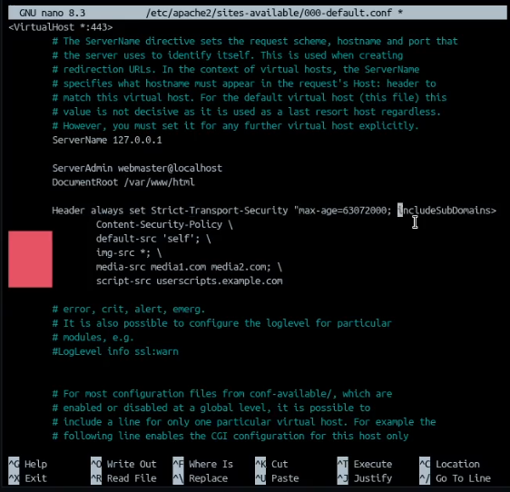
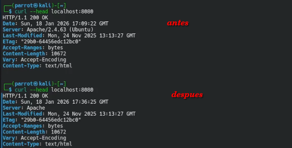
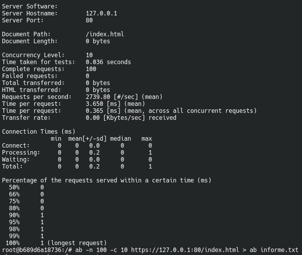

# RA3_1 - Apache Hardening

Se nos presentan diferetes prácticas para securizar un servidor apache. [INTRO](URL_TASKS) :

# Tasks

* [TASK_1](#URL_TASK_1): CSP
* [TASK_2](#URL_TASK_2): Web Application Firewall
* [TASK_3](#URL_TASK_3): OWASP
* [TASK_4](#URL_TASK_4): Evitar ataques DDOS

# Task_1: CSP

Comandos para la deshabilitación de autoindex y habilitación de headers:
```bash
a2dismod autoindex

a2enmod headers
```

### Archivo de configuración de los sitios


### headers comprobación


Enlace a DockerHub: [ENLACE](https://hub.docker.com/r/pps10722447/ra3-1)

comando para correr el contenedor:
```bash
docker run \
--detach \
-p 8080:80 \
-p 8081:443 \
--name="ra-3-1-1" \
pps10722447/ra3-1
```


# Task_2: Web Application Firewall

Comandos para la habilitación de WAF modsecurity:
```bash
apt install libapache2-mod-security2

a2enmod security2
```

Comandos para poner las reglas que vienen por defecto:
```bash
cp /etc/modsecurity/modsecurity.conf-recommended /etc/modsecurity/modsecurity.conf
```

### - Reiniciamos el contenedor 

### headers comprobación


Enlace a DockerHub: [ENLACE](https://hub.docker.com/r/pps10722447/ra3-1-2)

comando para correr el contenedor:
```bash
docker run \
--detach \
-p 8080:80 \
-p 8081:443 \
--name="ra-3-1-2" \
pps10722447/ra3-1-2
```

# Task_3: OWASP

Nos bajamos y aplicamos las reglas del OWASP:
```bash
git clone https://github.com/SpiderLabs/owasp-modsecurity-crs.git
cd owasp-modsecurity-crs
mv crs-setup.conf.example /etc/modsecurity/crs-setup.conf
mv rules/ /etc/modsecurity
```

modificamos: Archivo modificado sites-available:


### - Reiniciamos el contenedor 

### comprobación


Enlace a DockerHub: [ENLACE](https://hub.docker.com/r/pps10722447/ra3-1-3)

comando para correr el contenedor:
```bash
docker run \
--detach \
-p 8080:80 \
-p 8081:443 \
--name="ra-3-1-3" \
pps10722447/ra3-1-3
```

# Task_4: DDoS

instalamos el módulo "evasive":
```bash
apt install libapache2-mod-evasive
```
### no hace falta habilitarlo, el solito lo hace. 
### Reiniciamos el contenedor 

Usamos apacheBench (viene por defecto) para hacer saltar las alarmas:
```bash
ab -n 100 -c 10 https://127.0.0.1:80/index.html
```

informe de apacheBench:


### comprobación


Enlace a DockerHub: [ENLACE](https://hub.docker.com/r/pps10722447/ra3-1-4)

comando para correr el contenedor:
```bash
docker run \
--detach \
-p 8080:80 \
-p 8081:443 \
--name="ra-3-1-4" \
pps10722447/ra3-1-4
```