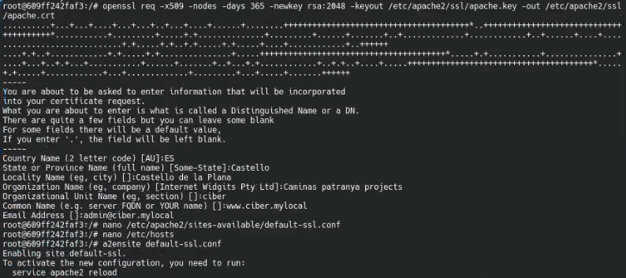
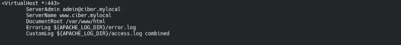
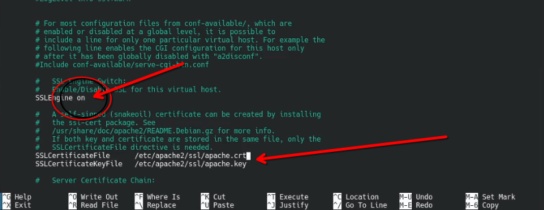
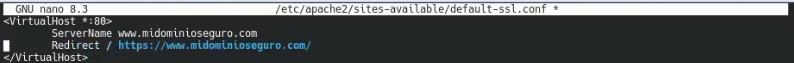
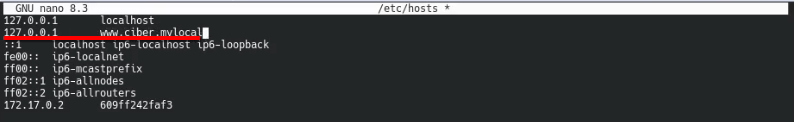
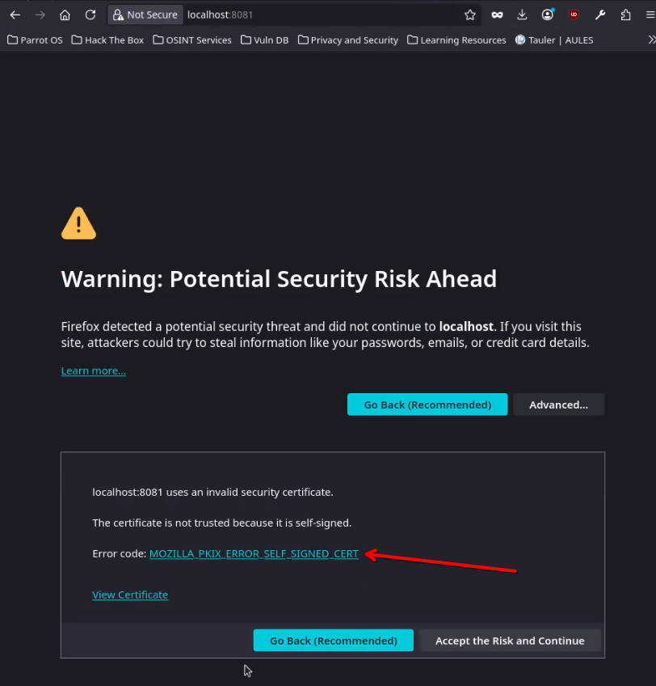
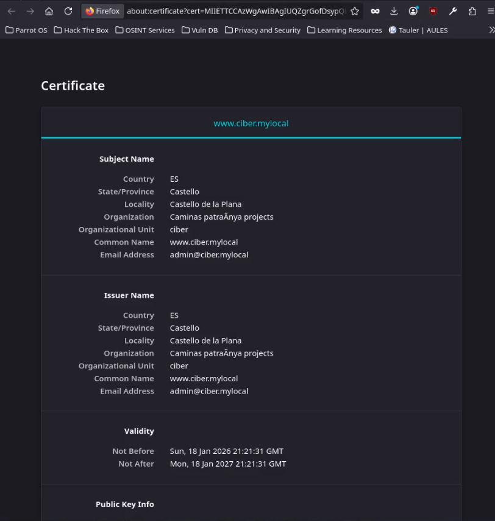

# RA3_2: Certificados
# Tasks

* [TASK_1](#URL_TASK_1): Instalar un certificado digital en el servidor Apache y realizar la imagen Docker.

# Task_1: Instalar un certificado digital en el servidor Apache.

Primero habilitaremos SSL en nuestro servidor apache2 (aunque ya viene activado por actividades anteriores):

```bash
a2enmod ssl
```

Ahora haremos un certificado autofirmado y lo desplegaremos sobre nuestro apache2:


```bash
mkdir /etc/apache2/ssl/

openssl req -x509 -nodes -days 365 -newkey rsa:2048 -keyout /etc/apache2/ssl/apache.key -out /etc/apache2/ssl/apache.crt
```
*rellenamos la información del certificado*


Ahora modificaremos la configuración predefinida del sitio con SSL ubicado en "/etc/apache2/sites-available/default-ssl.conf" para usar los certificados creados con openssl:




Adicionalmente, podemos añadir una redirección para que bajo ningún concepto se use http (puerto 80):



Tambien cambiaremos el archivo "/etc/hosts" para que nuestro nombre de dominio para que el servidor apunte a si mismo.



Entonces borraremos otras páginas dentro de "sites-availables" para que no interfieran y reiniciaremos el servidor para que se apliquen los cambios.

## comprobación:
Ahora desde fuera si intentamos acceder al servidor, podremos ver que si nos está detectando el certificado autofirmado:



Y si decidimos mirar los datos del certificado...



Enlace a DockerHub: [ENLACE](https://hub.docker.com/r/pps10722447/ra3-2-1)

Para ejecutar el contenedor:
```
docker run \
--detach \
-p 8080:80 \
-p 8081:443 \
--name="ra-3-2" \
pps10722447/ra3-2-1
```
