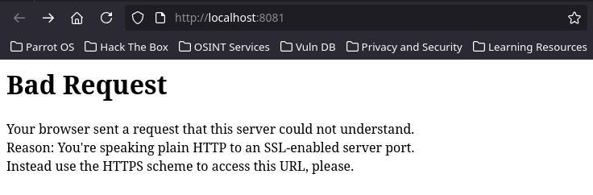
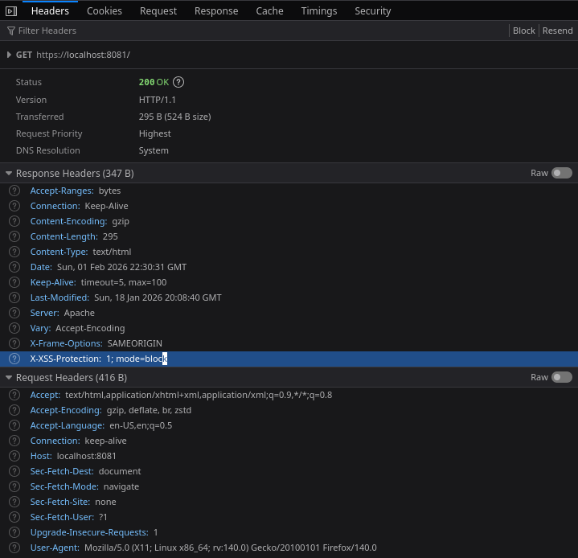

# RA3_1

# Tasks

* [TASK_1](#URL_TASK_1): Apache Hardening Best Practices

# Task_1: Apache Hardening Best Practices

Ahora aplicaremos una serie de configuraciones en nuestro servicio de apache para bastionar aun más nuestro servidor.

Primero cambiaremos los permisos del directorio donde se guardan los ficheros web para que el usuario "www-data" **SOLO** pueda leer.

```bash
chown -R root:root /var/www/html
chmod -R 755 /var/www/html
```

A continuación aplicaremos las practicas en el fichero global de configuración de apache2 "/etc/apache2/apache2.conf". Pero antes habilitaremos el módulo RewriteEngine con "a2enmod".

```bash
a2enmod
rewrite
```

Ahora es cuando hacemos los siguientes cambios en "apache2.conf". Estos están en el fichero "listaModifApache2-conf".


Ahora reiniciaremos el servidor y comprobaremos que todo ha funcionado correctamente. A continuación comprobaciones de *algunas* de las configuraciones realizadas:




Para ejecutar el contenedor:
```
docker run \
--detach \
-p 8080:80 \
-p 8081:443 \
--name="ra-3-3" \
pps10722447/ra3-3-1
```